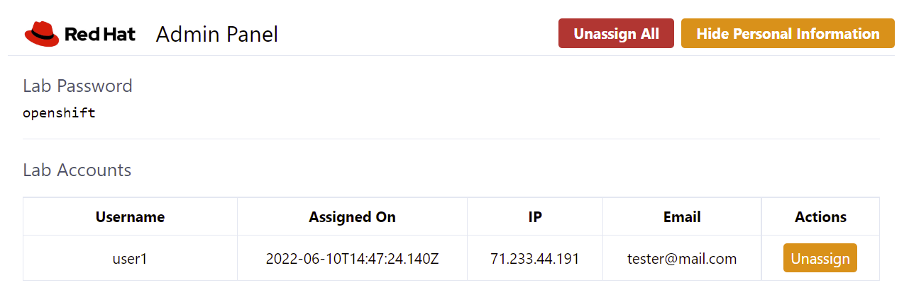

= 3scale Workshop

This is a subset of the content present in the [DIL-Agile-Integration](https://github.com/RedHat-Middleware-Workshops/dayinthelife-integration), focused on 3sale.
In this repository you will find the workshop content and how to install it in OpenShift.

== Required Resources

[NOTE]
====
TBD
====

== Ansible Requirements

You will need Ansible installed in your workstation to deploy this workshop.

* https://www.ansible.com/[Ansible 3]
- https://docs.ansible.com/ansible/latest/installation_guide/intro_installation.html#control-node-requirements[Ansible's requirement]
* https://pypi.org/project/kubernetes/[Python's Kubernetes module]
* OpenShift CLI(oc) > 4.10
* OpenShift Workshop 4.10

[NOTE]
====
This workshop was tested specifically on OpenShift 4.10.
====

== Installing the Workshop

=== Parameters

[options="header"]
|=======================
| Parameter    | Example Value                                      | Definition
| token        | sha256~vFanQbthlPKfsaldJT3bdLXIyEkd7ypO_XPygY1DNtQ | access token for a user with cluster-admin privileges
| server       | https://api.${domain}.com:6443                     | Cluster API URL.
| num_users    | 8                                                  | Number of participants expected in the workshop. Please, have in mind that the more participants you have, more resources you are going to need from the cluster.
|=======================

== Running the Playbook
----
# Set the environment variables
token=REPLACE_ME
server=REPLACE_ME
num_users=REPLACE_ME

# Run the playbook
ansible-playbook -e token=${token} -e server=${server} -e num_users=${num_users} playbook.yml
----

== User Registration Page

The URL will be displayed by the `Installation Finished` task. Attendees will interact with the following page to start:

image::doc/img/user-distribution-console.png[User Distribution]

== User Registration Admin page

The URL will be displayed by the `Installation Finished` task. Use this page to verify who got an user.

